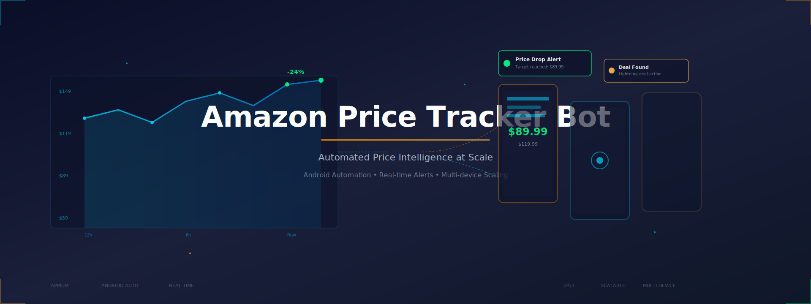

# Amazon Price Tracker Bot

A production-ready Android automation that monitors Amazon product prices, detects discounts, and pushes instant alerts across your preferred channels. This Amazon Price Tracker Bot eliminates manual checks, scales across devices/accounts, and delivers clean, structured data for decisions and dashboards. Use it to protect margins, catch lightning deals, and automate price intelligence—reliably and at scale.

  

 
 
 
 

 
   Created by Appilot, built to showcase our approach to Automation! 
   <strong>If you are looking for custom Amazon Price Tracker Bot, you've just found your team — Let’s Chat.👆👆</strong>

## Introduction

**What it does**  
Continuously tracks product prices, availability, and discount events on Amazon using Android device automation, then triggers alerts and exports structured records for BI or downstream systems.

**Problem it automates**  
Manual price checking is slow, error-prone, and easy to miss during flash sales. This bot automates navigation, search, product page parsing, and logging—24/7.

**Benefits**  
Higher deal-capture rate, faster competitive response, reliable audit trails, and scalable monitoring across locales, devices, and multiple Amazon accounts.

### Automating Amazon Price Monitoring & Alerts
- Targets product detail pages, wishlists, and search results; extracts price, strike-through list price, coupons, and stock signals.
- Works on real Android devices and emulators to mimic true user flows and avoid brittle HTML assumptions.
- Batches and streams results to databases, sheets, or webhooks—perfect for dashboards, repricers, and alerts.
- Built-in resilience: retry, backoff, crash recovery, and device watchdogs for stable overnight runs.
- Operates with human-like gestures, randomized timings, and scroll patterns to reduce detection risks.

## Core Features

- **Real Devices and Emulators:** Run on physical phones or Android emulators (BlueStacks, Nox) for authentic UI flows and better resilience to UI changes.  
- **No-ADB Wireless Automation:** Control devices over Wi-Fi without tethered ADB; cleaner racks and fewer cable failures during long sessions.  
- **Mimicking Human Behavior:** Randomized taps, swipes, dwell times, and context-aware pauses to emulate real usage patterns.  
- **Multiple Accounts Support:** Rotate between Amazon accounts, profiles, and regions; isolate sessions with per-account cookies and storage.  
- **Multi-Device Integration:** Horizontal scaling across device farms; sharded task queues dispatch SKUs to available workers.  
- **Exponential Growth for Your Account:** Catch more deals, trigger smarter restocks, and feed repricers/ads with timely signals to compound growth.  
- **Premium Support:** Priority onboarding, SLA-backed incident response, and hands-on tuning for your catalog and markets.  

## Additional Capabilities

| Feature | Description |
|---|---|
| Proxy Rotation & Geo-Targeting | Assign per-device proxies to simulate target locales (US/UK/DE/JP), unlocking region-specific price/stock views. |
| Smart Scheduling & Rate Limiting | Cron-like schedules with adaptive pacing to avoid throttling; slot windows per ASIN group. |
| CAPTCHA & Anti-bot Handling | Heuristics and fallbacks for interstitials; configurable human-in-the-loop for edge screens. |
| Alert Channels (Telegram/Email/Webhooks) | Push real-time alerts with price delta, threshold breach, and product context. |
| Data Export & Webhook Sink | Write to CSV/Parquet/Sheets/DBs; emit structured JSON events to your pipeline. |
| Audit Logs & Replay | Full session logs, screenshots on anomalies, and replay scripts for post-mortem debugging. |

  

## How It Works

1. **Input or Trigger** — From the Appilot dashboard, select SKUs/ASINs/keywords, regions, thresholds, and alert channels; start a one-off run or schedule recurring scans.  
2. **Core Logic** — Appilot drives the Android device/emulator via **UI Automator/Appium**, navigating Amazon, opening PDPs, revealing price blocks, expanding coupon sections, and capturing structured fields.  
3. **Output or Action** — The bot emits normalized records (price, list price, coupon, stock, timestamp, device, locale) and triggers alerts when thresholds or deltas are hit.  
4. **Other functionalities** — Automatic retries, exponential backoff, health pings, screenshot-on-error, rolling logs, and parallel execution across the device fleet; all tunable in the dashboard.

## Tech Stack

- **Language:** Kotlin, Java, Python, JavaScript  
- **Frameworks:** Appium, UI Automator, Espresso, Robot Framework, Cucumber  
- **Tools:** Appilot, Android Debug Bridge (ADB), Appium Inspector, BlueStacks/Nox, Scrcpy, Firebase Test Lab, MonkeyRunner, Accessibility Service  
- **Infrastructure:** Dockerized device farms, Cloud emulators, Proxy networks, Parallel Device Execution, Task Queues, Real device farm

## Directory Structure

    amazon-price-tracker-bot/
    │
    ├── src/
    │   ├── main/
    │   │   ├── kotlin/
    │   │   │   └── com/appilot/pricebot/
    │   │   │       ├── App.kt
    │   │   │       ├── device/DeviceController.kt
    │   │   │       ├── flows/AmazonFlow.kt
    │   │   │       ├── parsers/PriceParser.kt
    │   │   │       ├── storage/Exporter.kt
    │   │   │       └── util/Retry.kt
    │   │   └── python/
    │   │       ├── scheduler.py
    │   │       ├── webhook_sink.py
    │   │       └── reporters/telegram_notifier.py
    │   ├── test/
    │   │   └── AmazonFlowTest.kt
    │
    ├── config/
    │   ├── devices.yaml
    │   ├── accounts.yaml
    │   ├── regions.yaml
    │   └── thresholds.yaml
    │
    ├── scripts/
    │   ├── run_local.sh
    │   ├── run_farm.sh
    │   └── bootstrap_device.sh
    │
    ├── logs/
    │   └── runner.log
    │
    ├── output/
    │   ├── snapshots/
    │   ├── exports/
    │   │   ├── latest.csv
    │   │   └── latest.parquet
    │   └── events/
    │       └── stream.jsonl
    │
    ├── requirements.txt
    ├── package.json
    ├── build.gradle.kts
    └── README.md

## Use Cases

- **E-commerce operators** use it to watch competitor ASINs and trigger repricing, so they can protect margins and Buy Box share.  
- **Private-label brands** use it to detect sudden couponing or stock-outs, so they can time ads and inventory replenishment.  
- **Deal communities** use it to catch lightning deals and alert subscribers, so they can increase engagement and affiliate revenue.  
- **Procurement teams** use it to track BOM-related SKUs, so they can optimize purchase timing and reduce costs.

## FAQs

**How do I configure multiple accounts and regions?**  
Add entries in `accounts.yaml` and `regions.yaml`; the scheduler shards SKUs across devices with per-account cookies and per-region proxies.

**Does it support proxy rotation or anti-detection?**  
Yes. Define proxy pools per device; the controller rotates endpoints, randomizes gestures/timings, and respects adaptive rate limits.

**Can I schedule it to run periodically?**  
Use the dashboard or `scheduler.py` cron presets to run minute/hour/day cadences with time windows and concurrency caps.

**What price fields are captured?**  
Current price, list price (strike-through), coupon presence/value, stock signals (e.g., “Only X left”), timestamp, and locale—plus raw screenshot on anomalies.

**How are alerts delivered?**  
Via Telegram bot, email, or generic webhooks. Each alert contains the ASIN, previous vs current price, delta, and a deep link.

## Performance & Reliability Benchmarks

- **Execution Speed:** ~2.5–4.0 seconds per PDP on warmed devices; ~400–900 SKUs/hour per 10-device shard (typical).  
- **Success Rate:** 95% successful extractions over sustained 24-hour runs with retries and backoff enabled.  
- **Scalability:** Proven on 50–300 Android devices; architecture supports 1,000+ with additional queue workers and proxy capacity.  
- **Resource Efficiency:** Headless emulators for bulk scans; real devices reserved for tricky flows; CPU/memory tuned per AVD profile.  
- **Error Handling:** Per-step retries, circuit breakers on repeated failures, screenshot-on-error, structured logs, and Slack/Telegram incident hooks.

---  

**License & Support**  
Commercial support available with SLAs, onboarding, and custom feature development. Reach out for device farm sizing, KPI planning, and integration help.

